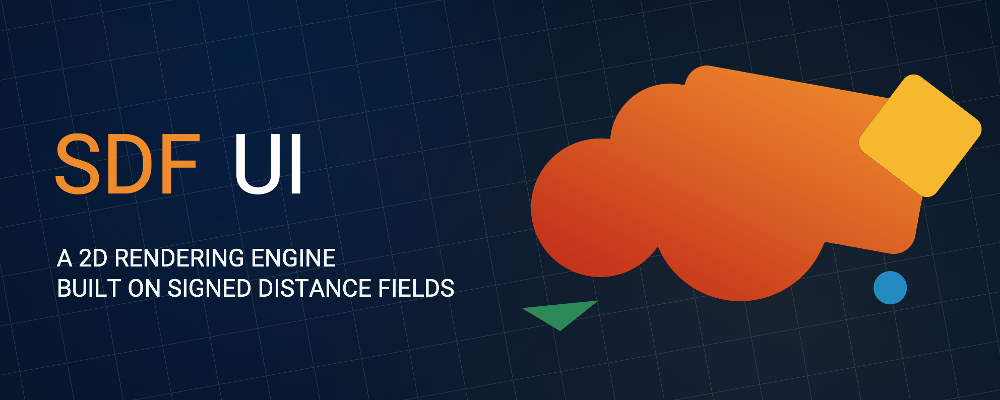
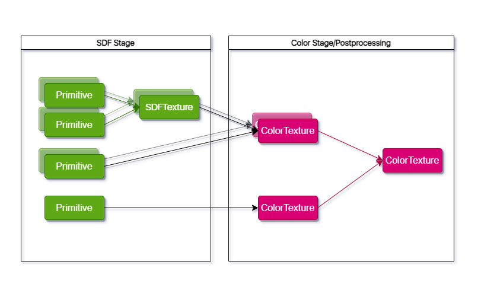
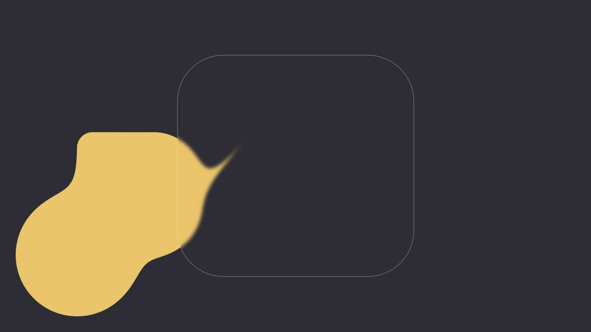
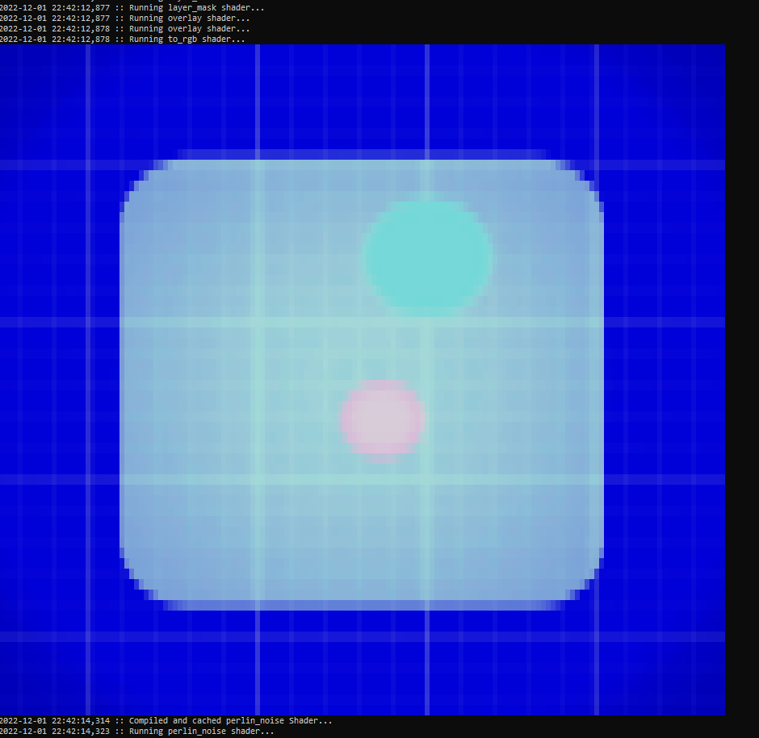
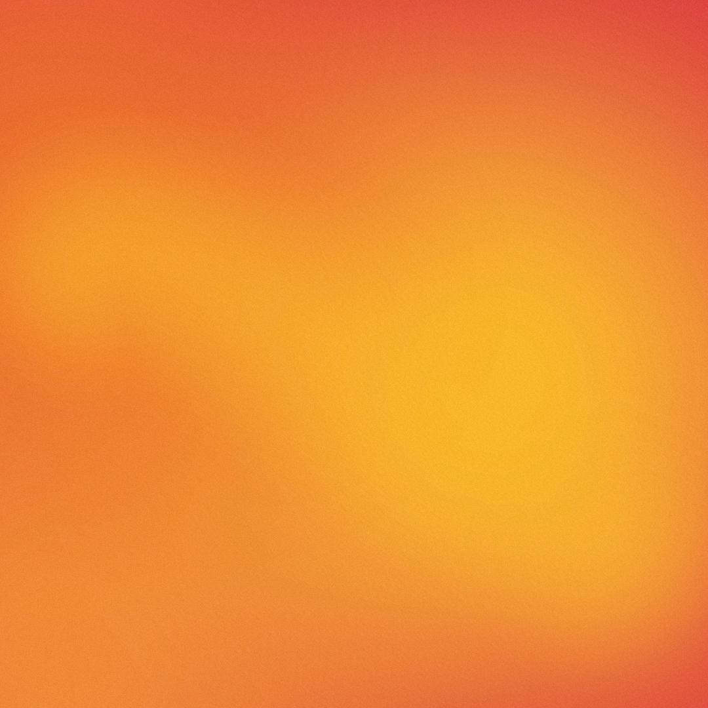
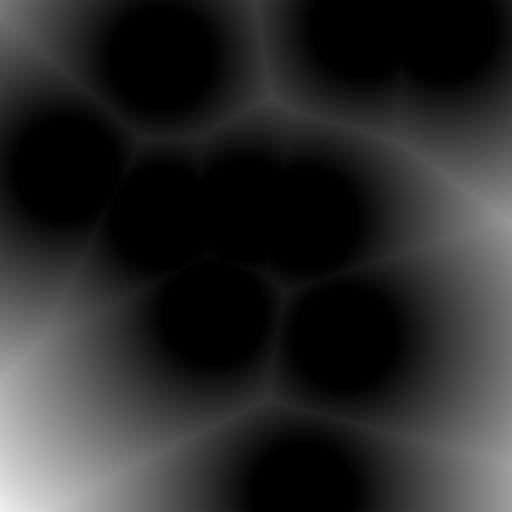

# SDF UI

What started [here](https://github.com/sebastianjkern/metaballs), has become a not yet fully featured but relatively complex 2d graphics rendering engine with gpu support.

SDF UI is the result of the experiment if you can extend the idea of MSDF text rendering and SDF based circle rendering to all standard 2D rendering stuff. Why don't draw rectangles, bezier curves, lines etc. with SDFs aswell. While in theory this is quiet slow, it offers great features like morphing between figures pretty much out of the box. And the determining factor of rendering cost is the size of the canvas and not the complexity of the object. For example the grid in the picture down below has pretty much the same cost as the rounded rectangle. And pretty much everything can be drawn with antialiasing without additional cost. And depending on what you're drawing, the rendered textures can be used again. 

Many SDFs used by this project were originally created by [Inigo Quilez](https://iquilezles.org/articles/distfunctions2d/).


### Why are basic Features not available?

All roads lead to Rome. Many basic sdf shapes can be expressed trough boolean operations of other basic shapes. For example convex polygons can be expressed as the intersection of halfplanes. Non-convex polygons are not as simple, but can be expressed trough this technique aswell. The trick is to render the union of convex polygons that make up the non-convex polygon.

Arcs can be represented as sdfs aswell. Subtract a small circle from a bigger circle and join the intersection of the remaining circle outline with two halfplanes. Even though halfplane sdfs don't exist yet, they can be expressed trough rotated rect. 

### But why should i use the sdf-ui library?

While some functionality is not yet available or quiet expensive, many features are cost effective in comparison. While traditional render pipelines (atleast if they don't copy memory) have problems with repetition (Drawing 1000 circles is more expensive than 1 circle), sdf-ui can flex its muscles, because drawing equally spaced objects multiple times comes at a fixed cost. Drawing 1000 circles in a grid is not more expansive than drawing 100 circles in a grid.

This makes the renderer especially interesting for procedural 2D scenes, repeated motifs, boolean-heavy shape construction, and soft effects like antialiasing, outlines, masks, and morphing. Instead of paying mainly for scene complexity, many operations behave more like full-canvas field evaluation, which opens up a different set of strengths than a traditional draw-call-based backend.

### Installation:

The project is structured to allow for pip installation:

```bash
pip install git+https://github.com/sebastianjkern/sdf_ui
```

For interactive work, prefer `Canvas.render(...)`, the built-in `.save(...)` method on render nodes, or a cached `Canvas.session(...)`.

### Usage:

The public API is built around render nodes. `sdf` creates signed-distance-field textures,
`color` creates color textures, and `Canvas` materializes the same nodes on the GPU:

```python
from sdf_ui import Canvas, color, sdf

scene = (
    color.clear("#ffffff")
    .over(
        sdf.circle(("40%x", "50%y"), "18%min")
        .smooth_union(sdf.rect(("58%x", "50%y"), ("22%x", "18%y"), ("3%min", "3%min", "3%min", "3%min")), k="2%min")
        .fill("#62bb47", (0.0, 0.0, 0.0, 0.0))
    )
    .post.blur(1)
    .to_rgb()
)

cache = {}
with Canvas((640, 360)) as canvas:
    scene.save("out.png", ctx=canvas, cache=cache)
```

### Architecture Note

Internally, `sdf_ui` is organized around immutable render nodes instead of immediate drawing calls.
Factories such as `sdf.circle(...)` and `color.clear(...)` do not render right away. They build a
small expression graph of `TextureNode` objects that can be composed, cached, and rendered later
against a `Canvas`.

At render time, the node graph is resolved by the renderer and dispatched through the plugin
registry. Each primitive, shading step, layer operation, or postprocessing effect is registered as
plugin metadata plus shader code, which keeps the runtime extensible without forcing the public API
to be hardcoded in one giant module.

To keep editor support and static analysis usable for library users, the public typed API is also
generated at build time from the plugin metadata. That means new plugins can extend the runtime
surface while shipped `.pyi` stubs still provide autocomplete and type checking for the supported
entry points.

That architecture is a good fit for experimentation: new primitives, shading passes, post effects,
and composition operators can be added as plugins without redesigning the public API each time.

### How it works:



### What can i do with this engine?

Take a look below, or at the banner image, that was also created using this engine ;)
___

<table>
    <tr>
        <th>Transparency</th>    
        <th>Text Letter Rendering</th>
        <th>Print Images to console</th>
        <th>Freeform Gradient</th>
    </tr>
    <tr>
        <td></td>
        <td></td>
        <td></td>
        <td></td>
    </tr>
    <tr>
        <th>BW Voronoi Texture</th>    
        <th></th>
        <th></th>
        <th></th>
    </tr>
    <tr>
        <td></td>
        <td></td>
        <td></td>
        <td></td>
    </tr>
</table>

### Performance Improvements

- [ ] Subframe rendering (Smaller feature set but far better performance in most tasks)
- [ ] Changing Local Size can (in theory) improve performance
- [ ] Dirty-region rendering so unchanged parts of the canvas can be skipped
- [ ] Render-graph caching for repeated subtrees and reusable procedural scenes

### Ideas for further development

- [x] Black and white to sdf conversion using go (solved via reverse sdf)
- [ ] Native Support for animation
- [ ] Vector Fields
- [ ] Voronoi sdf (Basically many overlayed circle sdfs)
- [x] Text rendering (Stroke rendering of single letters already possible)
- [ ] Rendering of text with custom sdf font
- [x] Freeform Gradients (Overlay of Different gradients, possible trough half transparent fills of sdfs)
- [ ] Ortographic Projection of 3D SDFs
- [x] Fill with images (trough moderngl texture api)
- [ ] Domain warping and turbulence for procedural field-based scenes
- [ ] First-class glow, bevel, and inner-shadow effects
- [ ] Native animation timelines and time-based shader controls
