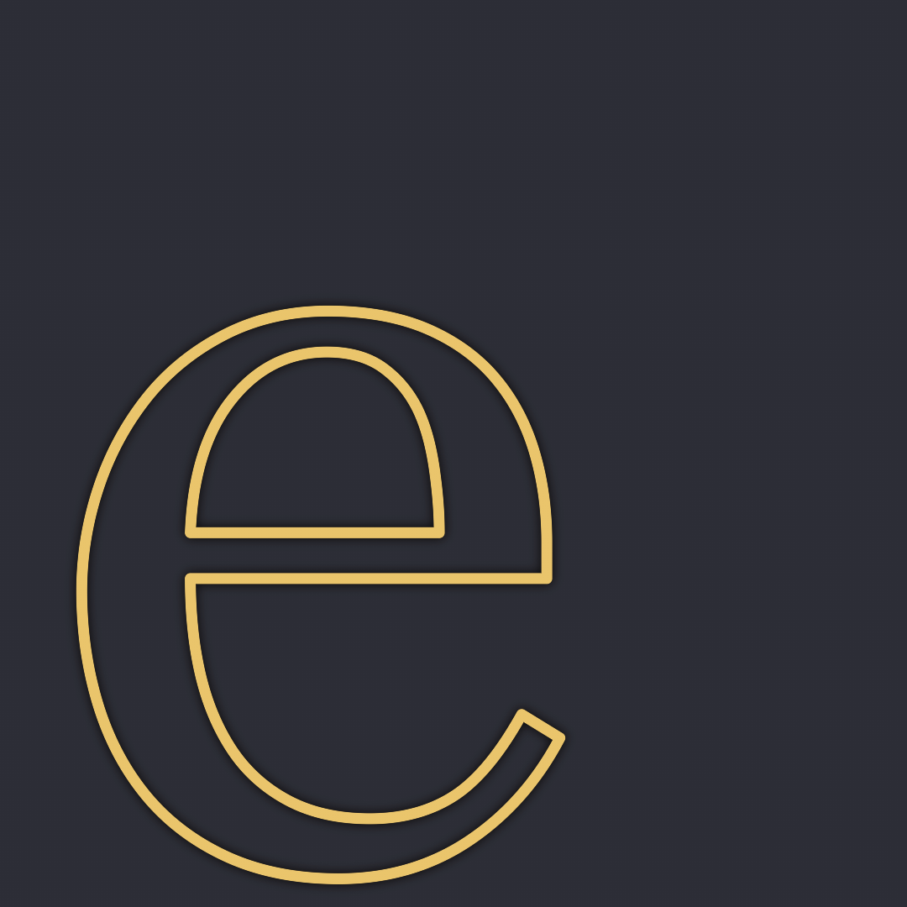
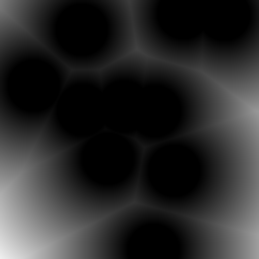

# SDF UI

What started [here](https://github.com/sebastianjkern/metaballs), has become a not yet fully featured but relatively complex 2d graphics rendering engine with gpu support.

SDF UI is the result of the experiment if you can extend the idea of MSDF text rendering and SDF based circle rendering to all standard 2D rendering stuff. Why don't draw rectangles, bezier curves, lines etc. with SDFs aswell. While in theory this is quiet slow, it offers great features like morphing between figures pretty much out of the box. And the determining factor of rendering cost is the size of the canvas and not the complexity of the object. For example the grid in the picture down below has pretty much the same cost as the rounded rectangle. And pretty much everything can be drawn with antialiasing without additional cost. And depending on what you're drawing, the rendered textures can be used again. 

Many SDFs used by this project were originally created by [Inigo Quilez](https://iquilezles.org/articles/distfunctions2d/).


### Why are basic Features not available?

All roads lead to Rome. Many basic sdf shapes can be expressed trough boolean operations of other basic shapes. For example convex polygons can be expressed as the intersection of halfplanes. Non-convex polygons are not as simple, but can be expressed trough this technique aswell. The trick is to render the union of convex polygons that make up the non-convex polygon.

Arcs can be represented as sdfs aswell. Subtract a small circle from a bigger circle and join the intersection of the remaining circle outline with two halfplanes. Even though halfplane sdfs don't exist yet, they can be expressed trough rotated rect. 

### But why should i use the sdf-ui library?

While some functionality is not yet available or quiet expensive, many features are cost effective in comparison. While traditional render pipelines (atleast if they don't copy memory) have problems with repetition (Drawing 1000 circles is more expensive than 1 circle), sdf-ui can flex its muscles, because drawing equally spaced objects multiple times comes at a fixed cost. Drawing 1000 circles in a grid is not more expansive than drawing 100 circles in a grid.

### Installation:

The project is structured to allow for pip installation:

```bash
pip install git+https://github.com/sebastianjkern/sdf_ui
```

For whatever reason, running the engine in an interactive python shell, the .show() function doesn't really work

### How it works:


### Examples:
___

<table>
    <tr>
        <th>Transparency</th>    
        <th>Text Letter Rendering</th>
        <th>Print Images to console</th>
        <th>Freeform Gradient</th>
    </tr>
    <tr>
        <td></td>
        <td></td>
        <td></td>
        <td></td>
    </tr>
    <tr>
        <th>BW Voronoi Texture</th>    
        <th></th>
        <th></th>
        <th></th>
    </tr>
    <tr>
        <td></td>
        <td></td>
        <td></td>
        <td></td>
    </tr>
</table>

### Performance Improvements

- [ ] Subframe rendering (Smaller feature set but far better performance in most tasks)
- [ ] Changing Local Size can (in theory) improve performance

### Ideas for further development

- [ ] Black and white to sdf conversion using go
- [ ] Native Support for animation
- [ ] Vector Fields
- [ ] Voronoi sdf (Basically many overlayed circle sdfs)
- [ ] Text rendering (Stroke rendering of single letters already possible)
- [ ] Rendering of text with custom sdf font
- [x] Freeform Gradients (Overlay of Different gradients, possible trough half transparent fills of sdfs)
- [ ] Ortographic Projection of 3D SDFs
- [x] Fill with images (trough moderngl texture api)
- [ ] YAML based render script, or node based editor, unsure about the alignment with the target specs
- [ ] Hot reload of script to create art with