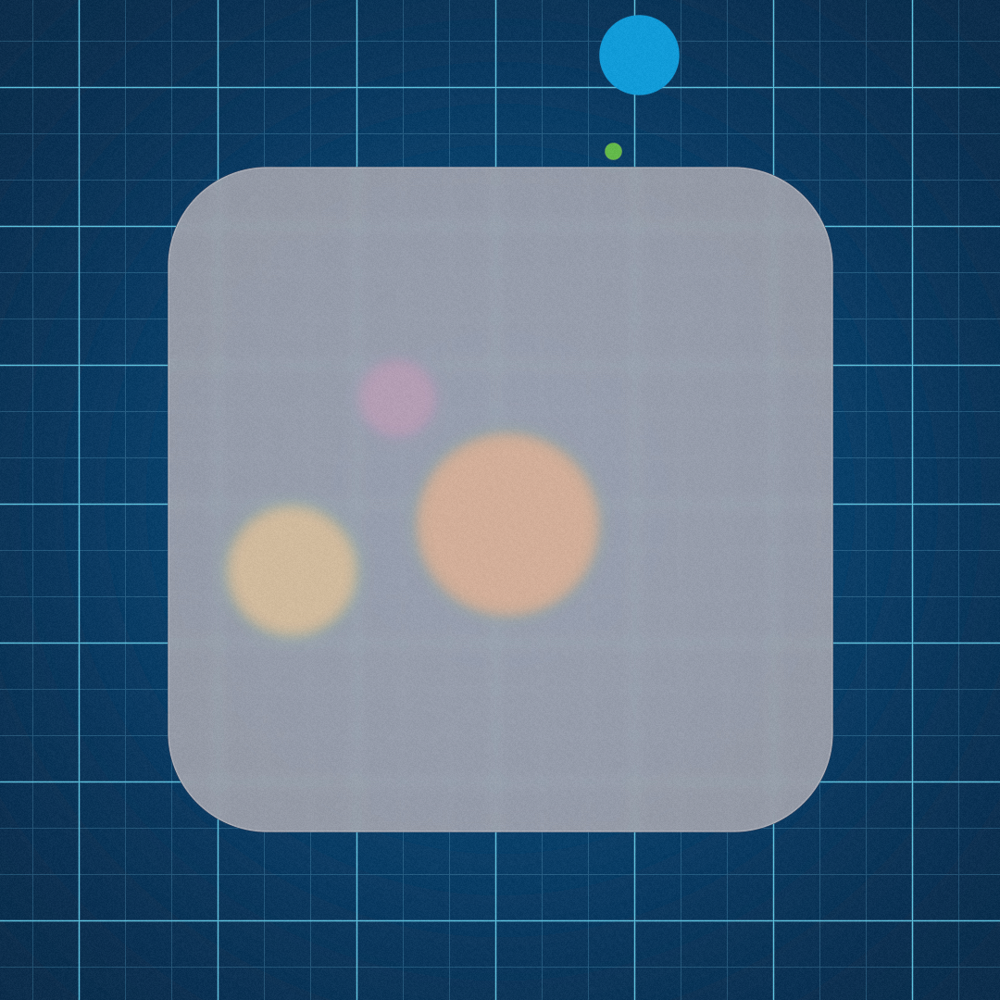
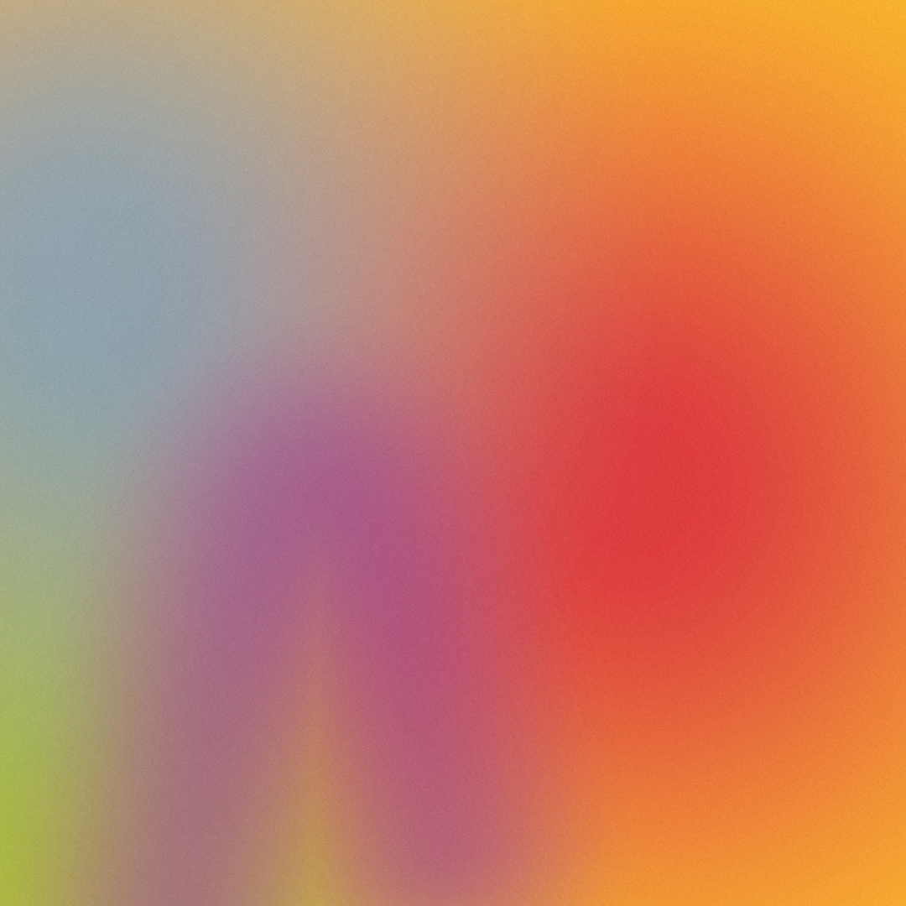

# SDF UI

___



Text/Letter rendering:


Print images to console:

 

Freeform Gradient:



## Ideas for further development

- [ ] Native Support for animation
- [ ] Vector Fields
- [ ] Voronoi sdf (Basically many overlayed circle sdfs)
- [ ] Text rendering (Stroke rendering of single letters already possible)
- [x] Freeform Gradients (Overlay of Different gradients, possible trough half transparent fills of sdfs)
- [ ] Ortographic Projection of 3D SDFs
- [ ] Fill with images (trough moderngl texture api)
- [ ] YAML based render script

## Example

```python
import logging
import random

from framework.context import Context
from framework.log import logger
from framework.main import set_context, clear_color, radial_gradient, bezier, film_grain, percent_of_min, grid, disc,
    linear_gradient, rounded_rect, glyph_sdf
from framework.util import hex_col

size = (1920, 1080)

logger().setLevel(logging.INFO)


def rand_color():
    red = random.randint(0, 255) / 255
    green = random.randint(0, 255) / 255
    blue = random.randint(0, 255) / 255
    return red, green, blue


def rand_point():
    x = random.randint(0, size[0])
    y = random.randint(0, size[1])

    return x, y


COLORS = [
    "#62bb47",
    "#fcb827",
    "#f6821f",
    "#e03a3c",
    "#963d97",
    "#009ddc"
]

context = Context(size)
set_context(context)

# Example 1
col0 = random.choice(COLORS)
col1 = random.choice(COLORS)
col2 = random.choice(COLORS)
col3 = random.choice(COLORS)

image = clear_color(hex_col(random.choice(COLORS)))
    .alpha_overlay(
    radial_gradient((100, 100), hex_col(col0, alpha=150), hex_col(col0, alpha=0.0), inner=50, outer=750))
    .alpha_overlay(
    radial_gradient((750, 500), hex_col(col1, alpha=255), hex_col(col1, alpha=0.0), inner=50, outer=750))
    .alpha_overlay(
    radial_gradient((100, 750), hex_col(col2, alpha=180), hex_col(col2, alpha=0.0), inner=50, outer=750))
    .alpha_overlay(
    bezier(rand_point(), rand_point(), rand_point()).fill(hex_col(col3, alpha=150), hex_col(col3, alpha=0),
                                                          inflate=0, inner=0, outer=250))
    .alpha_overlay(film_grain().transparency(10 / 255))

image.to_rgb().show()

```
